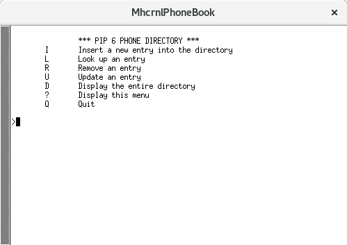

# Phonebook
C++ program developed on Code Block in folder MhcrnlPhoneBook. Acesta a fost compilat pe un sistem Fedora 24 si Code::Blocks 16.01.

## Instalare
```
git clone https://github.com/mhcrnl/Phonebook-35.git
cd Phonebook-35
```
Deschiderea proiectului MhcrnlPhoneBook in Code::Blocks.

## Utilizare
Proiectul are fisierele :

    1. directory.h / directory.cpp
    2. entry.h / entry.cpp
    3. main.cpp
